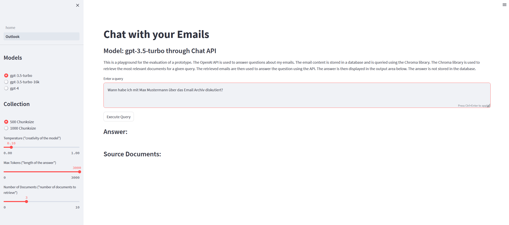
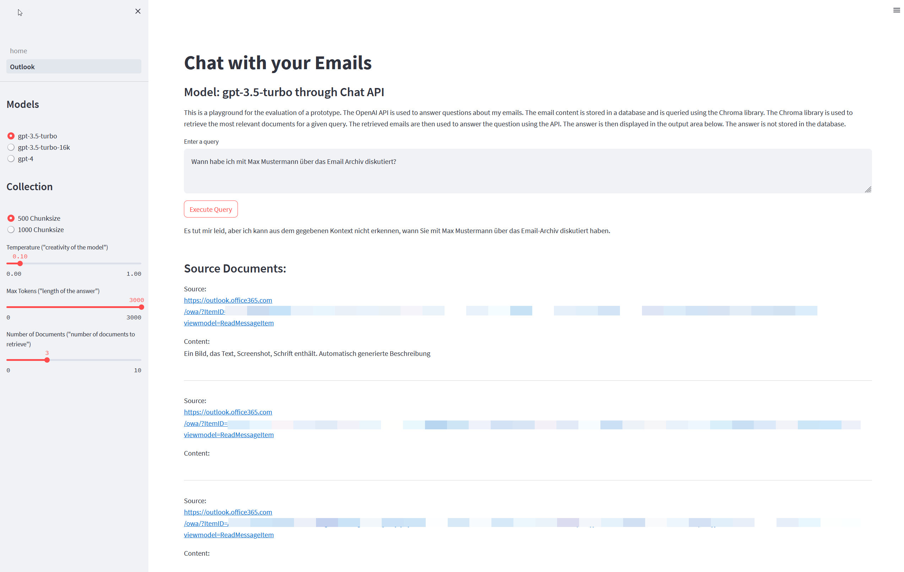

# Chat with your Emails

The project tries to solve a common problem: searching for emails by context instead of email adresses or keywords only. It also lets you summarize the content of an email conversation. And for reference and more detailed information it provides you with the web link (if used on Outlook 365).

The implementation uses OpenAI API, Langchain framework and ChromaDB to create a Streamlit app to query emails. It uses OpenAI, because it is kind of the State of the Art in usability and results. This way it should be the benchmark for me when trying to use other models.

The project is the final project of the **CAS for Advanced Machine Learning 2022** at the University of Bern, Switzerland.


## Table of Content


- [Goals](#goals)
- [Features](#features)
- [Next steps / To Do](#next-steps--to-do)
- [Tech Stack](#tech-stack)
- [Requirements](#requirements)
- [Environment Variables](#environment-variables)
- [Installation](#installation)
- [Workflow](#workflow)
- [Usage/Examples](#usageexamples)
- [Demo](#demo)
- [Lessons Learned](#lessons-learned)
- [Acknowledgements](#acknowledgements)
- [Author](#author)

 - [Documentation /scripts](https://github.com/johannesmichael/CAS-AML-final-public/tree/main/scripts#documentation)


## Goals

- Create a real world application
- Learn about the preprocessing of the data and the time it takes until you can use them
- create a standard to compare with other approaches, like other models
- Create scripts, not notebooks, to make it usable for a pipeline
- get insights in to the fast changing world of LLMs and related libraries
- solve the dependency hell of python
- learn about multiprocessing and distributed compute
- stard developing a playground for internal use and future development
## Features

- Download Emails from your Outlook Inbox
- Create an Azure Blob Storage table with the content
- Get the latest Email by conversation
- Use OpenAI API to structure the content and create a summary
- Embedd that structured content with OpenAI Embedding API
- Create a vectorstor to store the embeddings
- Use Streamlit App to query your Emails


## Next steps / To Do

- Embedd content of attachments, so it can be queried as well
- add other vectorstores like Redis, FAISS, Pinecone, etc. to evaluate different stacks
- create own Retriever, to improve results
- use open source models to compare with OpneAI
- create playground to use different models and vectorstores side by side
- create pipeline to ingest new Emails regularly 

Follow up project:
- finetune models to see if results improve (started here https://github.com/johannesmichael/lit-gpt-local)
- try to create own model with company data to adress domain knowledge (based on the paper TinyStories https://arxiv.org/abs/2305.07759)
## Tech Stack

**Language:** Python 3.10

**Main packages:** Langchain, Chromadb, Streamlit, Poetry

**Databases:** Azure Blob Storage, Chromadb

**Models:** GPT-3.5-turbo, GPT-3.5-turbo-16k, GPT-4, text-embedding-ada-002


## Requirements

- For use of OpenAI API an API-Key is needed.
- For use of Microsofts Outlook REST API an Azure subscription. Details here: https://learn.microsoft.com/en-us/outlook/rest/get-started
- 
## Environment Variables

First, rename `environment.env` to `.env`

Add the following environment variables to your .env file or system


`OPENAI_API_KEY` -->  OpenAI API-Key

`OUTLOOK_CONTENT_CONNECTION_STRING`  --> Connection string for Azure Blob Storage


## Installation

To install the necessary dependencies, follow these steps:

1. Clone the repository to your local machine (only Linux Systems, I used WSL on Windows 11).
2. Navigate to the project directory.
3. The project uses poetry and conda for creating the environment (detailed instructions here: https://stackoverflow.com/questions/70851048/does-it-make-sense-to-use-conda-poetry)


```bash
conda create --name CAS --file conda-linux-64.lock
conda activate CAS
poetry install
```


For updating the environment add the conda packages to the environment.yml and use

    # Re-generate Conda lock file(s) based on environment.yml
    conda-lock -k explicit --conda mamba
    # Update Conda packages based on re-generated lock file
    mamba update --file conda-linux-64.lock
    # Update Poetry packages and re-generate poetry.lock
    poetry update

For adding packages from PyPi use

    poetry add <package_name==version>
## Workflow

Diagrams not done yet
## Usage/Examples

The project has the following structure:

```
.
├── Streamlit
│   ├── assets
│   └── pages
├── archiv
├── db
│   └── index
├── notebooks
└── scripts

8 directories

```

Detailed tree structure with files can be found in tree.txt

### scripts

Starting point of the project. The scripts are numbered in order of execution.

- 01_get_email_content.py: This script is used to retrieve the content of the emails.
- 02_prepare_email_gpt.py: This script uses OpenAI API to process the content.
- 03_openai_embeddings_chromadb.py: This script generates embeddings using the OpenAI model and stores the emails in the vectorstore.
- 04_query.py: This script is used to query the vectorstore.
- 04a_query_multiretriver.py: This script is uses the MultiRetriver from Langchain.

### db

Folder to store the vectorstore files

### Streamlit

Folder for the Streamlit App. 
Just use

    cd Streamlit
    streamlit run home.py
Output:

    You can now view your Streamlit app in your browser.

    Local URL: http://localhost:8501
   


and click on the localhost URL provided to see the app.
Select Outlook from the Menue





On the left side you can adjust the settings for

1. Model: Works best with gpt-3.5-turbo-16k because of the lenght of some emails
2. Collection: To experiment with the different chunksizes. 1000 seems to work best for longer emails
3. Temperature: Call it the creativity allowed by the model when generating answers. Default to 0, which works best for this use case.
4. Max. Tokens: Maximun number of tokens the answer generated by the model can have. Depends on the model chosen.
5. Number of documents to retrieve from the vectorstore.

The main window:

Query: Enter your instructions here
Answer: Answer generated by the model based on the query
Source Documents: The number of emails used for generating the query. Providing a weblink to the email in outlook365.


### notebooks

The collection of notebooks used to develop and test the scripts. Each notebook contains a header explaining the purpose. They are all left like they were after testing, so it is work in progress.

### archive

Collection of drafts made during the development process. For example attempts to run scripts with multiprocessing, asyncio or distributed with Ray or Dask.

### singele files in root folder

Files for setting up the conda environment

    conda-linux-64.lock
    conda-lock.yml
    environment.yml
    poetry.lock
    pyproject.toml

Copy of the `.env` file if present in .gitignore. Just rename it and adjust to your needs, like adding the environment variables

    environment.env

Configuration for use in debug mode in VS Code

    launch.json

### Detailed description of the scripts

README.md file in the scripts folder

[Documentation here](scripts/README.md)


## Demo

A demo video will follow. Need to create some dummy data first....


## Lessons Learned

Data is the most important piece for a project like this!

First, how to get the data. If you want to run it in a pipeline, it should not require manual work. That is why I chose to use the Microsoft Outlook API instead of a file based approach (which could use multiprocessing).

After several attempts on different output from the API I opted for the MIME representation of the emails, since the structure is always the same (standardized) and there is a library in the standard python distribution: `email`

Then it comes to data cleaning. One thing is to remove unwanted characters or extensive use of newlines. Also emails from iOS devices adds a lot of clutter. But emails are full of ads and unimportant information (like signatures) for the purpose of this application. To get rid of them the best way I found was to send the preprocessed content to OpenAIs gpt models and let it structure, clean and classify it.

Classifying it is not necessary for the inital purpose, but I thought, I could use it later to finetune or train a model based on these. I actually startet that process by using the `lightning` and `fabric` library from [Lightning.ai](https://lightning.ai/). See also Github page [here](https://github.com/Lightning-AI/lit-gpt). But training it locally, even with 2 GPU Nvidia RTX 4090 requires a lot of optimizing and I did not succeed to this point. But will follow to explore that path in order to create own models.

Second challenge was the use of document and vectorstore. I tried it with Redis Cloud, to have a DB in the cloud and not only locally. But with the first approach I reached the free tier limit pretty soon, so I decided to start with local ChromaDB and try out Redis and other solutions later, when all points are clear.  
Most challenging was the integration in to the code. Even with the extensive integrations provided by `langchain` library, it was not that trivial, since the development is on the fast lane. So I got errors with my dataset (it worked on the first small part, but later with the whole it failed). So I set up the ingestion and embedding process myself using the chromadb library directly.

Finding the right parameters for the preprocessing and embeddings showed a big impact on the results in the query. My first approach wiht `chunk_size=500` did not give me satisfying results. For example it often returned one good result (meaning the context of the email matched the query), but also completly unrelated emails.  
After that I tried it with 2000, which did not work either. The last approach of `chunk_size=1000` and `chunk_overlap = 50` showed very good resuls, returning the right emails by 90 %. (I have to admitt, that it depends on the prompt for the query as well. That is why one of the future work will be on implementing my own retriever).

Side note: I did not experiment with different alghorithms for similarity search or different metrics or Retrievers. The vectorstore databases offer here different approaches as well the Langchain Retriever library. I used the `RetrievalQA`. with the `chain_type="stuff"`. See the Retriever Section in this Readme.

Since data processing can take a long time, especialld when making calls to an API like the one from OpenAI, I experimented with different approaches, like multiprocessing, multithreading, asyncio, and distributed compute like Ray and Dask (with Modin for Pandas).
But except for the embeddings, I could not use it. I ended up with an error rate of 25 % on `gpt-3.5`. Since the rate limit is pretty high, I am unsure why that happened. But did not have the time to dig deeper into it. My queries for roughly 3000 emails took more than 3 hours and cost me around 10 $.  
This will be a topic for the next phase of development: using open source models and even finetun some. 

The last step I did with the data, was to create a dataset for instruction finetuning. But here is eventually the next hurdle to take, since the sometimes long email conversations create large entries in the dataset, which might be a reason why I did not succeed with finetuning so far. But more on this later.

Some time also went into finding the best way to query the models, so prompt engineering was a big part. My first try was to get the content stuctured as a `JSON` object. But when the finish reason of the API was `lenght`, the JSON was incomplete. And the model did make other faulty formatting once in a while. So processing the responses was tedious work. At the end, I changed the approach to a more text based list with a special sequence (`<br>`) to separate the entries. That was way better, since I did not have to rely on `ast.eval` to parse the JSON string.

Also the prompt for the summary took some approaches. In the beginning I tried it with an example in the prompt, but the the response contained the example text in the response if the email content was very short.

In the beginning I also had trouble with the maximum tokens in the API calls and responses. Luckily OpenAI introduced the `gpt-3.5-turbo-16k` with a context lenght of 16 000 tokens and reduced the prices for all models. That way I was able to choose the model based on the content token lenght. There is still some improvement on the error handling to be done, but overall I had a response quality of more than 95 %.

After I got satisfying results in my queries, I decided to create a Streamlit app for playing around with different settings. Now I am able to run queries using different models and different collections in my databases. Next step will be the implementation of a playground to be able to compare different models, settings and introduce human feedback.  The project I am looking at is this [here](https://github.com/nat/openplayground) 

### Outlook

Next steps will be implementation of the playground. After that I will work on different Vectorstores and Retrievers.  
Then the next challenge is the finetuning of open sourec LLM, like **tiuae falcon** models and the **Guanaco 7b**  
Huggingface  
[link to falcon](https://huggingface.co/tiiuae/falcon-7b)  
[link to Guanaco](https://huggingface.co/JosephusCheung/Guanaco)

I chose these, because the `falcon-7b` has a good performance and the `Guanaco 7b` is also trained on German data. I will try to finetune them locally, but till now I always hit an `OutOfMemory` error in `cuda`. Even wiht small batch sizes and `precision=bf16-mixed` with the [Adapter](https://arxiv.org/abs/2303.16199) and [LoRa](https://github.com/microsoft/LoRA) strategies implemented in Lightning.ai repository [here](https://github.com/Lightning-AI/lit-gpt/tree/main)


### Conclusion

First goal was to create a real world app that can be used. Second was the rising request in our organization to start looking into the emerging field of LLMs. My focus was more on Timeseries data before, since I develop business cases in the IoT sector. But the hype around ChatGPT also got me hooked because I see quite some potential for our organization and the speed of development in the last 6 months is amazing. It changed the way how I develop and code as well as my daily work: it is present all the time.  
But this project proved again the importance of high quality data to achieve good results. All tutorials are based on existing datasets and as soon as you use your own, the problems appear. In the beginning I was looking at all the promising tools to use, but today I even know, that even popular frameworks like Langchain or LLamaIndex are not the silver bullet that solves all your problems. This is the biggest learning for me, since I am not the Data Scientist nor the developer, I have to decide which strategy to follow or which problem to solve with which tools or frameworks. Or where to get the information needed to decide. And even that I did most of the work after business hours or on weekends, it was fun and I learned a lot (and the feeling of being in the middle of a live/work changer is exiting). 
## Acknowledgements

Documentations:

 - [Microsoft Outlook REST API](https://learn.microsoft.com/en-us/outlook/rest/get-started)
 - [OpenAI API](https://platform.openai.com/docs/api-reference)
 - [openai-cookbook](https://github.com/openai/openai-cookbook)
 - [Langchain](https://python.langchain.com/docs/get_started/introduction.html)
 - [Chroma](https://docs.trychroma.com/)
 - [Streamlit](https://docs.streamlit.io/)
 - [Redis](https://redis.com/solutions/use-cases/vector-database/)
 - [LlamaIndex](https://gpt-index.readthedocs.io/en/latest/)
 

 Repositories:  

 - [PrivateGPT](https://github.com/imartinez/privateGPT)
 - [OpenLLMs](https://github.com/eugeneyan/open-llms)
 - [Redis Ventures](https://github.com/RedisVentures/redis-arXiv-search)
 - [falcontune](https://github.com/rmihaylov/falcontune)
 - [open-playground](https://github.com/nat/openplayground)

Tutorials:  
 - [Let's build GPT: from scratch, in code, spelled out](https://www.youtube.com/watch?v=kCc8FmEb1nY)
 - [HuggingFace Tutorial on text summarization](https://huggingface.co/docs/transformers/tasks/summarization)

Newsletters, Books, Papers
 - [Machine Learning Q and AI](https://leanpub.com/machine-learning-q-and-ai)
 - [Ahead of AI](https://magazine.sebastianraschka.com/)
 - [TinyStories: How Small Can Language Models Be and Still Speak Coherent English?](https://arxiv.org/abs/2305.07759)
 - [LLaMA-Adapter: Efficient Fine-tuning of Language Models with Zero-init Attention](https://arxiv.org/abs/2303.16199)


 and extensive use of ChatGPT and Perplexity.ai


## Author

**Johannes Römpp**  
CTO  
 Head of Software Development and IoT  
 at [AMBERG LOGLAY AG](https://ambergloglay.com/)  
Contact: jroempp@ambergloglay.com

